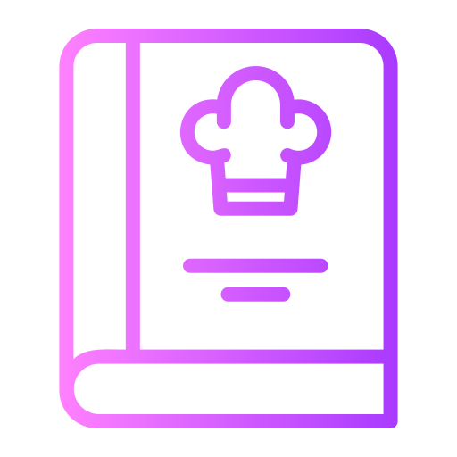

<h2>Recipe-App</h2>

 
 

# 📗 Table of Contents
- [📖 About the Project](#about-project)
  - [🛠 Built With](#built-with)
    - [Tech Stack](#tech-stack)
    - [Key Features](#key-features)
- [💻 Getting Started](#getting-started)
  - [Setup](#setup)
  - [Prerequisites](#prerequisites)
  - [Install](#install)
  - [Usage](#usage)
  - [Run tests](#run-tests)
  - [Deployment](#triangular_flag_on_post-deployment)
- [👥 Authors](#authors)
- [🔭 Future Features](#future-features)
- [🤝 Contributing](#contributing)
- [⭐️ Show your support](#support)
- [🙏 Acknowledgements](#acknowledgements)
- [📝 License](#license)

# 📖 Recipe-App 
Recipe App is a robust and user-friendly recipe application built using Ruby on Rails, leveraging the power of Bootstrap, Devise, and Capybara gems. Seamlessly create, discover, and share recipes with it. It offers a delightful cooking experience with its intuitive interface and extensive features.
**Recipe-App** 
## 🛠 Built With 
PostgresSQL
Ruby on rails
### Tech Stack 

> Ruby on rails

Ruby

  <ul>
    <li><a href="https://www.ruby-lang.org/en/">Ruby</a></li>
  </ul>

### Key Features 
-Add Foods with its value and measure unit
-Add Recipes with its cooking time and prep time
-If recipe is made public by that user than it shows under public recipes page

(<a href="#readme-top">back to top</a>)

## 💻 Getting Started 

- Recipe app

### Prerequisites

In order to run this project you need:

Ruby installed
  run Ruby main.rb

### Setup

Clone this repository to your desired folder:
  cd Recipe-App

    git clone https://github.com/anas599/Recipe-app.git
  

### Install

Install this project with:

  cd Recipe-app
  run rails server

### Usage

To run the project, execute the following command:
rails server

### Run tests

To run tests, run the following command:

rspec
### Deployment

You can deploy this project using:

(<a href="#readme-top">back to top</a>)
👥 Authors 

👤 **ANAS ALSAMMARRAIE**

- GitHub: [@anas599](https://github.com/anas599)
- Twitter: [@anas599](https://twitter.com/anas599)
- LinkedIn: [anas1993](https://linkedin.com/in/anas1993)

(<a href="#readme-top">back to top</a>)

## 🔭 Future Features 
- Add videos for new data
- Add images of food
- Update  style

(<a href="#readme-top">back to top</a>)

## 🤝 Contributing 

Contributions, issues, and feature requests are welcome!

Feel free to check the [issues page](../../issues/).

(<a href="#readme-top">back to top</a>)

## ⭐️ Show your support 

> If you like the project Please do not hesitate if you have any questions

(<a href="#readme-top">back to top</a>)

## 🙏 Acknowledgments 

> I would like to thank Microverse for this project based learning

(<a href="#readme-top">back to top</a>)

## 📝 License 

This project is [MIT](./LICENSE) licensed.

(<a href="#readme-top">back to top</a>)

